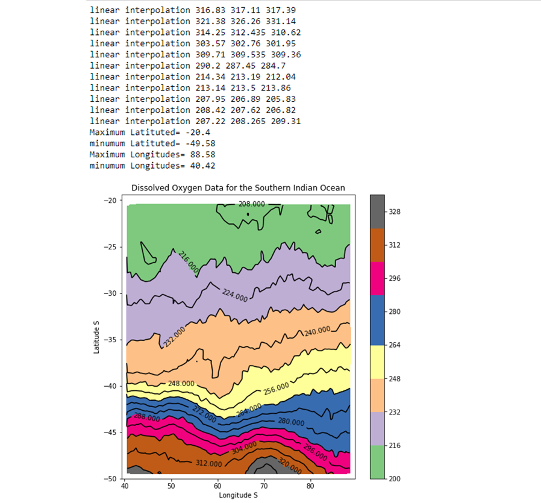
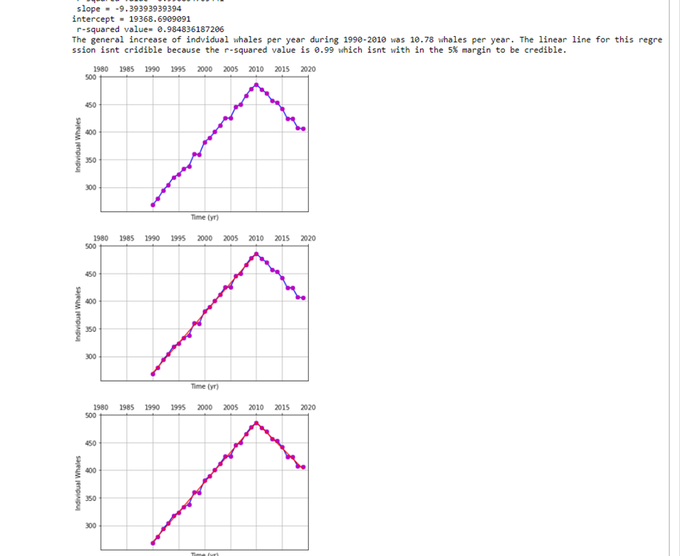

# Python-data-analysis-surface-dissolved-oxygen-data-

## Discription 

This Python assignment uses three diferent data sets to analyze and understand the data. 

The first problem uses surface dissolved oxygen data for the southern Indian Ocean to analyze the geographical extent (i.e., minimum and maximum latitudes and longitudes) of the data in the file and making a filled-contour plot of surface oxygen over the geographical area. 

The secound file uses marine mammal species list data. I wrote a code to read this file to analyze useful information about each species.

The third problem uses endangered Atlantic right whale population data to analyze and suppourt major effort in cataloging the numbers of these whales and attempting to increase their numbers.The file provides a history of the estimated number of these whales from 1990 to the present. Using this file, I carried out the following tasks. Make a plot of the number of individuals versus time, Carry out a linear regression for the time when the population was increasing, Carry out a linear regression for the time when the population was decreasing.

## Notes

 
 

## Skills Learned

* Dealing with files with missing data
* Dealing with missing data and corrupted data
* Dse of genfromtxt; the concept of NaN
* 2-D plotting; geographic maps
* End of line characters, random numbers, linear regression
* String-handling functions like the use of readline( )